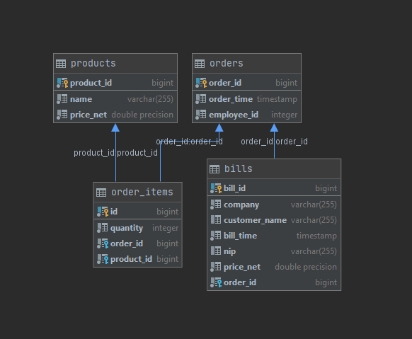
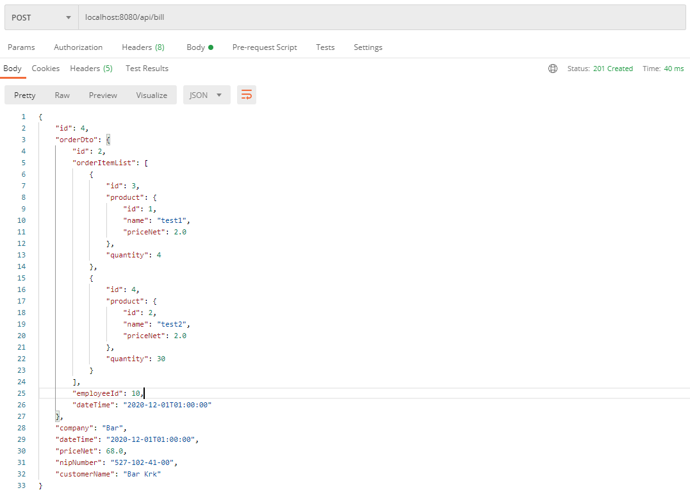

# BarApp

BarApp offers basic REST Api for bars. 

The application enables CRUD operation for Products, Orders and Bills.
Data is stored in PostgreSQL database.

Below there is presented database structure and entities.

OrderItem is additional entity created to keep relations between Orders and Products.

Filed "price_net" of Bill entity is calculated based on Product's price and quantity of Orders.
Example of Bill object:

To more info, run the app and check Swagger tools:

SwaggerUI:
/swagger-ui.html

SwaggerDocs:
/v2/api-docs
